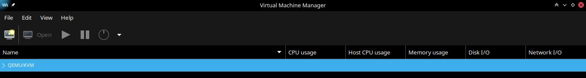

# Instalación de qemu-KVM

KVM es una solución de virtualización para Linux, que está incluido en el Kernel.

---

### Prerequisitos

Verificamos si el hardware soporta virtualización:

##### En el caso de Intel

	grep -e 'vmx' /proc/cpuinfo

##### En el caso de AMD

	grep -e 'svm' /proc/cpuinfo

Verificar que los módulos KMV estén cargados en el kernel, 'debe estarlo por defecto'

	lsmod | grep kvm

---

### Instalación e implementación

Instalar primero estos paquetes, estos proveen el gestor de imágenes de disco y kvm a nivel de usuario.
	
	sudo apt install qemu-kvm qemu-img

Instalar herramientas opcionales pero muy útiles para la administración de la plataforma.

	sudo apt install virt-manager libvirt libvirt-python libvirt-client 

Iniciar y verificar que el demonio 'libvirtd' se esté ejecutando, este es el que se va a encargar de gestionar la plataforma.

	sudo systemctl status libvirtd

---

### Creando una VM usando KVM

Iniciamos virt-manager, este es una aplicación gráfica que nos permite y facilita la creación, administración y supervisión de máquinias virtuales.

	virt-manager

 

 

A partir de aquí es bastante intuitivo crear los volúmenes, podemos crear redes nat, y por últimos las máquinas virtuales.
